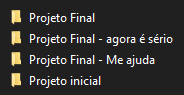
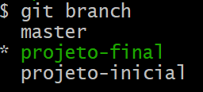
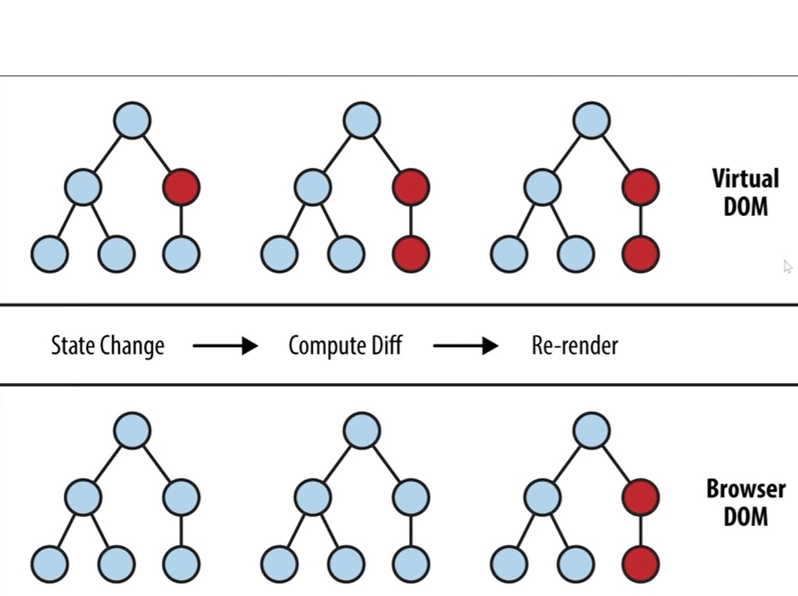

##
### React - 2 - React: como os componentes funcionam
##

<p align="center">
  
</p>


##
### Parte 1
##


### 52 - Apresentação

**Apresentação**

- Documentação
    - Link: https://pt-br.legacy.reactjs.org/
    - Node: https://nodejs.org/en

- criar o projeto react
```
npx create-react-app react-app_52
```

- Roda o projeto
```
npm start
```

- Localhost:
    - Link: http://localhost:3000/

- Exemplo:
    - react-app_52


### 53 - Clonando o repositório

**Clonando o repositório**

- Exemplo:
    - react-app_53

### 54 - Para saber mais: Git e Github

**Para saber mais: Git e Github**

Caso você não tenha conhecimento sobre git, não se preocupe! Neste curso não utilizaremos com frequência , mas para a sua carreira é muito importante entender como utilizar o Git e Github.

**Git**

Git é a ferramenta utilizada pelos desenvolvedores para controlar as versões do seu código, ou seja, ao invés de você ter algo assim:


<p align="center">
  
</p>


Você pode ter algo assim:

<p align="center">
  
</p>


Ao invés de você ter pastas diferentes com códigos parecidos, você terá `branches` com códigos parecidos!

`Branches` seriam uma representação dessas pastas que você criaria sem o Git, e caso você queira ir para uma destas `branches`, você pode utilizar o comando `git checkout`, por exemplo:

- `git checkout projeto-inicial` < estou na branch projeto-inicial
- `git checkout projeto-final` < estou na branch projeto-final
- `git branch projeto-final-2` < criei uma nova branch projeto-final-2
- `git checkout projeto-final-2` < entrei na branch projeto-final-2 que eu acabei de criar
- `git branch` < sem especificar nenhuma `branch`, o git me mostra todas as branches que eu tenho localmente

Viu? Git é algo muito útil e com o tempo fica muito intuitivo!

Beleza, eu já sei como criar uma branch e como andar de uma branch para outra, mas como eu faço para criar ou pegar um projeto com git???

Então, para criar um projeto com git, primeiro você precisa saber se o projeto já contém o git, para fazer isto, tem 2 formas principais:

- 1* Olhando se na raiz do projeto existe uma pasta `.git`;
- 2* No terminal, escreva qualquer comando git (como o `git branch`, por exemplo) e veja se o terminal entende, se ele entender, o seu projeto contém git, se não, provavelmente aparecerá algo com `not a git repository`.
E para pegar um projeto que já tem git??

Bom, para pegar um projeto que tem git, primeiro você precisa saber onde achar este projeto, certo? É aí que entra o Github!

**Github**

O Github nada mais é do que um site que guarda projetos git! Estes projetos são chamados de repositórios, e você pode ter repositórios públicos ou privados.Todos os repositórios que você tem acesso podem ser **clonados** ou **“forkados”**. E o que significa `clone` ou `fork`?

Antes de comentar sobre estes dois termos, tenho que explicar sobre algo chamado `remote`. Todo repositório pode ter um ou mais `remotes`, que nada mais são que link de repositórios online (como no Github) que você pode trocar informações, sendo pegar código novo ou enviar um código novo que está na sua máquina. O nome padrão do remote normalmente é `origin`, mas você pode adicionar o nome que você quiser em outros `remotes`, caso você queira fazer esta conexão.

**clone**

Com o clone, você copia o código para a sua máquina, porém o `remote` permanece o da pessoa que você clonou, ou seja, se você copiar o código do React por exemplo, o `remote` é o link do código real, do React. Como você não tem permissão para enviar código para o repositório oficial do React, fazer isto seria negado.

**fork**

Aí que entra o fork! O fork faz uma cópia daquele repositório no seu Github! Ele não copia o código para a sua máquina, mas após esta cópia, você poderá fazer um clone do seu repositório (o repositório copiado via fork) e agora o remote estará apontando para o seu Github, não mais para o Github oficial!


Agora que você sabe mais sobre estes termos, fique a vontade para fazer um clone ou um fork do repositório do projeto! ou se continuar com dúvidas, indicamos o curso de Git e Github aqui da Alura.

- Link: https://cursos.alura.com.br/course/git-github-repositorio-commit-versoes


- Exemplo:
    - react-app_54


### 55 - Instalando dependências

**Instalando dependências**

- NPM (Node Package Maneger)
```
npm install
```

- Exemplo:
    - react-app_55


### 56 - Faça como eu fiz: do clone ao start

**Faça como eu fiz: do clone ao start**

Faça um clone do repositório, instale as dependências e rode o projeto.

- Opinião do instrutor

Para clonar o repositório, devemos utilizar o comando `git clone`, apontando para o repositório oficial ou para o seu repositório, caso você tenha feito o `fork` do repositório.

```
git clone https://github.com/daniel-oliv3/organo // ou a URL do seu repositório
```

- Após isto, devemos entrar na pasta criada:

```
cd organo
```

- E instalar as dependências, com yarn:

```
yarn
```

- Ou com npm:

```
npm install
```

- Após a instalação, devemos rodar o projeto com o script start, com yarn:

```
yarn start
```

- Ou com npm:

```
npm start 
```

- Exemplo:
    - react-app_56


### 57 - O que aprendemos?

**O que aprendemos?**

- Nessa aula, você aprendeu:
  - Como clonar um projeto;
  - A diferença entre clone e fork;
  - Como instalar dependências de um projeto;
  - Como rodar um projeto.

- Exemplo:
    - react-app_57


##
### Parte 2
##


### 58 - Projeto da aula anterior

**Projeto da aula anterior**


- Exemplo:
    - react-app_58


### 59 - Biblioteca x Framework

**Biblioteca x Framework**

- React = `Biblioteca`

- Biblioteca 
    - Menor
- Framework
    - Mais robusto

- Exemplo:
    - react-app_59


### 60 - Criando aoDeletar

**Criando aoDeletar**

- Exemplo:
    - react-app_60

### 61 - Para saber mais: Closures e o map

**Para saber mais: Closures e o map**

Na aula passado, precisamos criar um bloco para que pudéssemos utilizar o `console.log`, e utilizamos chaves para criar este bloco.

Tá Luiz, mas o que isto tem a ver com o título deste para saber mais? Vamos ver o código da função .map que temos:

```js
{colaboradores.map((colaborador, indice) => <Colaborador key={indice} colaborador={colaborador} corDeFundo={time.corSecundaria} />)}
```

Primeiro destrincharemos esta linha de código e depois falaremos especificamente sobre o que ela tem a ver com o título.

- 1* - Como estamos utilizando o `.map`, podemos deduzir que `colaboradores` é um **array**;
- 2* - O **.map** aceita uma função como parâmetro, no nosso caso utilizamos uma `arrow function` para isto;
- 3* - A `arrow function` não necessita de um nome, ou seja, ela é uma **função anônima**;
- 4* - Como não temos chaves após a `arrow(=>)`, sabemos que ela não tem um bloco de código, apenas o retorno;
- 5* - Como não temos um bloco, sabemos que o retorno dela é o componente `Colaborador`.

Beleza, agora que conseguimos ter uma visão melhor, explica o que é `closure`!

Uma closure é um bloco dentro de uma função que nos permite colocar alguma informação dentro, ou seja, é o mesmo que um “bloco”, que é o que precisamos para colocar o console.log!

Veja estes 2 códigos:

```js
<Componente onClick={() => executarFuncao()}
```

```js
<Componente onClick={() => { executarFuncao() }}
```

Eles parecem muito parecidos, mas são diferentes! A diferença é que nesta arrow function, a primeira (sem as chaves) retorna a função e a segunda só a executa!

Na prática, isto não influencia em nada nesta parte do código, mas e aqui?

```js
{colaboradores.map((colaborador, indice) => { <Colaborador key={indice} colaborador={colaborador} corDeFundo={time.corSecundaria} /> })}
```


O que acontece neste caso?

Neste caso, o código não funcionaria! O map necessita de um retorno, pois a diferença entre o map e o forEach é que o map muda o item de cada array, então se ele não recebe nenhum retorno, o map interpreta todos os itens como undefined, então, caso você queira utilizar um bloco (ou uma closure) dentro do map, você é obrigado a retornar o que você quer que ele mostre.

Beleza, mas no código não tá escrito return, como eu estou retornando algo que eu não digo que estou retornando?

Aí que está a magia da coisa, você só precisa dizer que está retornando algo se você precisar utilizar a closure! Caso você não queira, apenas utilizando parênteses ou simplesmente não colocando nada, você já diz que está retornando!

Veja este código:

```js
pessoas.map(pessoa=> (
 <Pessoa nome={pessoa.nome} />
))
```

Os parênteses neste caso são iguais a não colocar nada, mas ele permite que você tenha um return de mais de uma linha! Porém como não temos uma closure, podemos apenas colocar os parênteses, sem o return! Caso você queira fazer algum cálculo, pode fazer algo assim:

```js
pessoas.map(pessoa => {
  const maiorDeIdade = pessoa.idade > 18;
  return (
   <Pessoa nome={pessoa.nome} maiorDeIdade={maiorDeIdade} />
 )
})
```

Neste caso, você está utilizando o closure (as chaves) e um return com mais de uma linha (com os parênteses) de uma vez só! Agora olhe o mesmo código:

Sem closure e sem return de mais de uma linha:


```js
pessoas.map(pessoa => <Pessoa nome={pessoa.nome} maiorDeIdade={pessoa.idade > 18} />)
```

Sem closure e com return de mais de uma linha:

```js
pessoas.map(pessoa => (
 <Pessoa nome={pessoa.nome} maiorDeIdade={pessoa.idade > 18} />
))
```

Então as chaves, os parênteses ou nada têm significado neste caso, e você agora sabe de todos eles!

- Exemplo:
    - react-app_61


### 62 - Criando o botão deletar

**Criando o botão deletar**

- Exemplo:
    - react-app_62


### 63 - Passando props

**Passando props**

Você estava passando a prop `aoDeletar` para seus componentes, mas a função não estava sendo executada no evento de click. Após pesquisas, percebeu que a prop `aoDeletar` estava `undefined`. Qual o possível motivo deste problema?

- Selecione uma alternativa
    - A: A função está com um nome diferente no componente que tem a função.
    - B: A função não tem retorno.
    - C: A função não está sendo criada no componente que quer usar.
    - D: A função não está sendo passada em todos os componentes acima do que você quer utilizar.
        - `Isso aí! Muito provavelmente, caso o seu componente esteja muito abaixo na árvore, você não está passando a função para todos os componentes!`


- Exemplo:
    - react-app_63


### 64 - Importando ícone de deletar

**Importando ícone de deletar**

- React Icons:
    - Site: https://react-icons.github.io/react-icons/

- Instalar o react icons

```
npm install react-icons --save
```

- Exemplo:
    - react-app_64


### 65 - Faça como eu fiz: instalar novas dependências

**Faça como eu fiz: instalar novas dependências**

Precisamos de um ícone para o nosso botão de deletar, instale o pacote `react-icons` e importe o ícone `AiFillCloseCircle` no arquivo `src/componentes/Colaborador/index.js`.

- Opinião do instrutor

Para instalar o pacote, execute no terminal:

```
npm install react-icons
```

E para importar o componente, coloque nas primeiras linhas do arquivo `src/componentes/Colaborador/index.js`:

```js
import { AiFillCloseCircle } from 'react-icons/ai';
```

Lembrando que as chaves significam que o export não é default, ou seja, dentro de `react-icons/ai` contém vários exports, não somente este ícone, e no pacote react-icons, a pasta do ícone que queremos é sempre a pasta que tem as mesmas letras do começo do nosso ícone, ou seja, o componente `AiFillCloseCircle` está dentro da pasta `ai`.

- Exemplo:
    - react-app_65


### 66 - O que aprendemos?

**O que aprendemos?**

- Nessa aula, você aprendeu:
    - Como criar uma nova prop;
    - Como passar esta prop para inúmeros componentes;
    - O que é uma closure e como utilizá-la a seu favor;
    - Como instalar novas dependências na sua aplicação;
    - Diferença entre export e export default.

- Exemplo:
    - react-app_66


##
### Parte 3
##


### 67 - Projeto da aula anterior

**Projeto da aula anterior**

- Exemplo:
    - react-app_67


### 68 - Criando input de cor

**Criando input de cor**

- Exemplo:
    - react-app_68


### 69 - Criando o state times

**Criando o state times**

- Exemplo:
    - react-app_69


### 70 - Mudando a cor dos times

**Mudando a cor dos times**

- Por que precisamos transformar a constante times em um state para mudar a cor?
    - A: Mudamos porque só assim o React “escuta a mudança”.
        - `Isso aí! Com o setState o React fica ciente que aquele pedaço pode ser mudado, e assim que ele é mudado, o React atualiza a tela por nós.`
    - B: Pois o state nos dá a função setState para mudar o valor da variável.
    - C: Pois só assim conseguimos mudar a variável de cor.
    - D: Com o state fica mais fácil de mudar.


- Exemplo:
    - react-app_70


### 71 - Mudando o background

**Mudando o background**

- hex-to-rgba
    - Link: https://www.npmjs.com/package/hex-to-rgba


- Installation
```
npm i hex-to-rgba
```

- Usage
```js
import hexToRgba from 'hex-to-rgba';
```

- Imperatividade
```js
//muda o primeiro card para red, console google chrome
document.querySelector('.colaborador').querySelector('.cabecalho').style.backgroundColor = 'red';
```

<p align="center">
  
</p>


- Exemplo:
    - react-app_71


### 72 - Para saber mais: Virtual DOM

**Para saber mais: Virtual DOM**

Durante o vídeo passado tocamos algumas vezes no termo Virtual DOM, mas afinal, o que é isto?

Virtual DOM é algo vital dentro do React, e é uma das coisas que fez o React ser tão famoso.Você provavelmente deve ter percebido como o React é inteligente e com rapidez ele atualiza o DOM? Então, isto tem tudo a ver com Virtual DOM!

Lembra que os componentes são vistos como objetos no React? O Virtual DOM armazena estes objetos, e quando algo muda dentro desta árvore de objetos, o React compara o DOM real com o que a gente quer que mude (que a gente chama de candidato) e atualiza apenas o que for mudado!

Vamos ver um exemplo:

Se a gente mudar o input de cor para uma nova cor, o que acontece?

- 1 - O input executa o evento onChange;
- 2 - O onChange executa a função mudarCor;
- 3 - O mudarCor execute o setTimes;
- 4 - O setTimes muda o state;
- 5 - O React percebe a mudança de state e compara o Virtual DOM com o DOM real, mudando as partes necessárias (no caso tudo que está relacionado com time.cor).
Neste momento o React tem uma “cópia” da árvore antes do evento e o “candidato”, que é a árvore com as mudanças após o evento, e compara o que deve ser atualizado por causa do evento, e a partir daí ocorre as mudanças!1-

- Exemplo:
    - react-app_72


### 73 - O que aprendemos?

**O que aprendemos?**

- Nessa aula, você aprendeu:
- O que é Virtual DOM;
Como o React escuta uma mudança e porque precisamos de um state para isto;
- Diferença de imperatividade e declaratividade.

- Exemplo:
    - react-app_73


##
### Parte 4
##


### 74 - Projeto da aula anterior

**Projeto da aula anterior**

- Exemplo:
    - react-app_74


### 75 - Criando ids

**Criando ids**

- uuid
    - Link: https://www.npmjs.com/package/uuid


- Install, terminal
```
npm i uuid
```

- Create a UUID (ES6 module syntax)
```
import { v4 as uuidv4 } from 'uuid';
```


- Exemplo:
    - react-app_75


